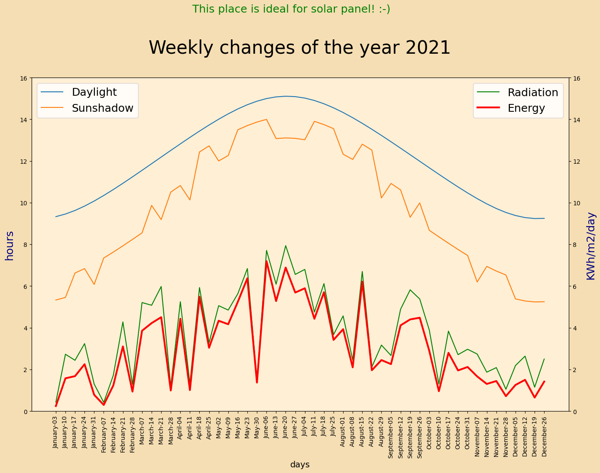
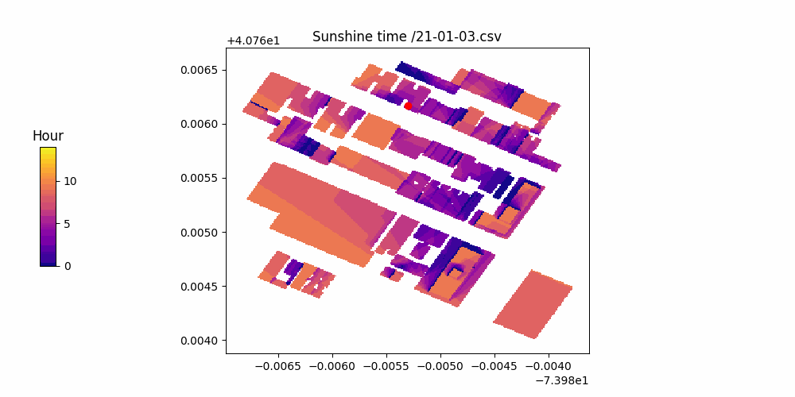

<!-- #region -->
# Sun & Shades for Solar Panels
## Check if it is interesting to implement a solar panel in a given place.


The goal of this repository is to provide a website to test the solar exposure of a place regarding the shadow of the surrounding buildings and the weather forecast history over the past year (2021). 
To decide if it worth to put a solar panel at a location, we choose the threshold of 4 kwh/m2/day. The goal is to display a plot of the variation of the solar exposure along a year and a GIF animation to see the variation of the sun around the location chose.
For the position longitude = "-73.98530154756561" and latitude = "40.76616942412636" in Manhattan, taking into account 52 sundays in 2021, we can show the variation along the year of :
-	the solar radiation,
-	the sunlight hours regarding the shadow of the buildings around 200 meters,
-	the solar radiation regarding the forecast of 2021
-	the solar energy
 

 
We want also to add a GIF animation of the neiboorhood to have a broader view of the shadows effect and display in color what's happen near the point of interest tested. The point of interest is displayed with a red dot.



The website need only a geolocation in longitude and latitude, but other parameters could be changed in the code :
-	The size of the area around the place (by default 50m)
-	The gap between 2 measures (by default precision =10800 seconds)
-	The accuracy of the measures (by default accuracy =1)
-	The time of the first/last measure regarding the sunrise/sunset (by default padding =1080 seconds)
-	The start and end date of the time range 
-	The number of days

The processing has been done with GCP, but it needs engineering to be in production. If anyone can help to do that it would be great.
Next steps:
-	Optimize processing time (area size, time precision)
-	Add terrain data
-	Add cost of local electricity  measure cost efficiency $$
-	Information of height of the buildings in Open Street Map is not always available

Feel free to comment.
If you want to help, you are welcome :)

<!-- #endregion -->

```python

```
